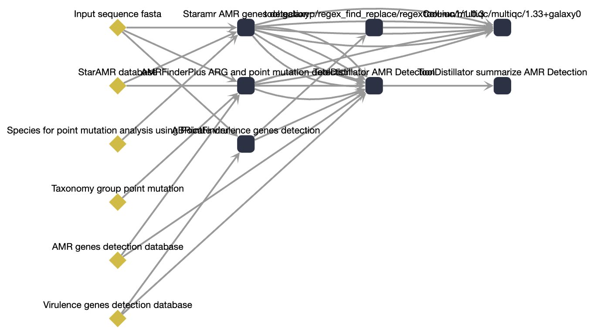
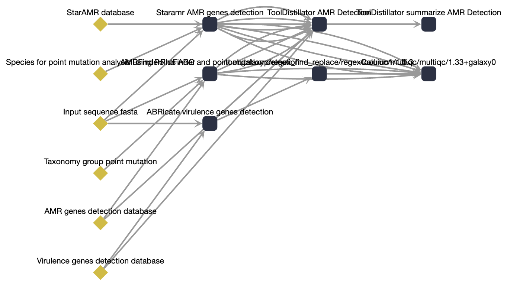

gxwf-layout
===========

``gxwf-layout`` computes node positions for a Galaxy workflow (Format 2
``.gxwf.yml`` or native ``.ga``) and merges ``{left, top}`` position records
back into the document, replacing the degenerate diagonal layout Galaxy applies
when positions are absent. For Format 2 YAML the original comments, key order,
and quoting are preserved; only position records are added or updated.

It gives hand-authored and machine-generated workflows sensible, stable
coordinates without opening them in the Galaxy workflow editor.

Cyclic workflows are invalid in Galaxy and are rejected with an error rather
than laid out.

Strategies
----------

``topological`` (default)
   Strict layering: column is the longest path from any input, row is
   declaration order within the column. Dependency-free and identical to
   :doc:`gxwf-viz --layout topological <cli_viz>` (a cross-language layout
   shared with the TypeScript port). Legible but applies no crossing reduction,
   so wide workflows can show more edge crossings.

``layered``
   `Sugiyama-style <https://en.wikipedia.org/wiki/Layered_graph_drawing>`_
   layered layout: the same longest-path layering plus a
   `barycenter <https://en.wikipedia.org/wiki/Layered_graph_drawing#Crossing_reduction>`_
   crossing-reduction pass that reorders rows to align each node with its
   neighbors. Fewer edge crossings on wide/real workflows. The exact
   coordinates are not a cross-language contract; both strategies satisfy the
   same structural properties (every edge points rightward, roots are leftmost,
   no overlapping nodes).

Comparing the strategies
------------------------

Both strategies assign the same columns; ``layered`` only reorders the rows
within each column to pull connected nodes into line. On dense, real-world
graphs this removes most edge crossings. The figures below lay out the
`amr_gene_detection <https://github.com/galaxyproject/iwc/tree/main/workflows/bacterial_genomics/amr_gene_detection>`_
IWC workflow (13 nodes, 28 edges, 4 layers) both ways -- positions stripped,
recomputed by each strategy, and rendered with :doc:`gxwf-viz --layout preset
<cli_viz>` (which honors the baked positions). Layered cuts the crossings from
13 to 2:

   ``gxwf-layout --strategy topological`` -- 13 edge crossings.

   ``gxwf-layout --strategy layered`` -- 2 edge crossings.

Both layouts satisfy the same structural properties (every edge points
rightward, roots are leftmost, no overlapping nodes); the workflow ships as the
``real-amr-gene-detection.ga`` example fixture.

Subworkflows
------------

By default ``gxwf-layout`` recurses into subworkflows defined **within the same
file**, giving each its own coordinate space:

- Format 2 steps with an embedded ``run:`` ``GalaxyWorkflow`` block
- native steps carrying an inline ``subworkflow:`` block
- every workflow in a ``$graph`` multi-workflow document

Subworkflows referenced by file path, URL, or ``$graph`` ``#id`` are *not*
followed -- at each level such a step is treated as a single node, matching the
Cytoscape builder. Pass ``--no-recursive`` to lay out only the top-level
document.

.. argparse::
   :module: gxformat2.layout._cli
   :func: _parser
   :prog: gxwf-layout
